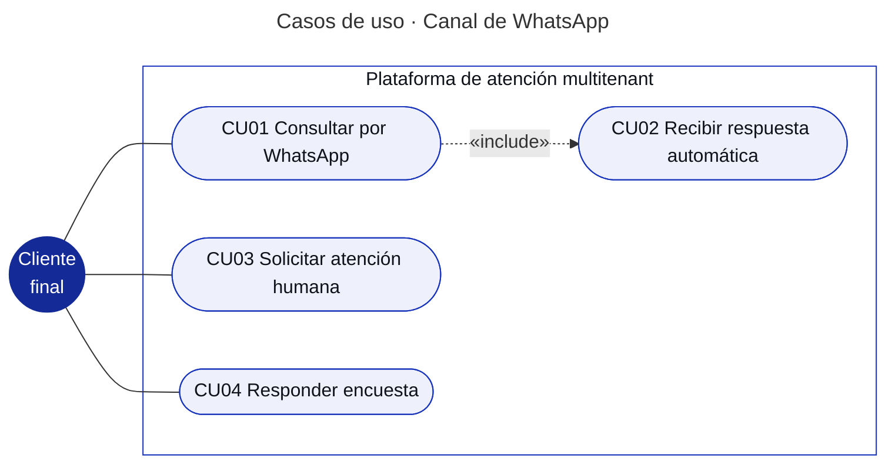

# Casos de uso · Canal de WhatsApp

El cliente final no inicia sesión: interactúa solo por WhatsApp.

```mermaid
---
title: "Casos de uso · Canal de WhatsApp"
---
flowchart LR
  CL(("Cliente<br/>final"))

  subgraph SYS["Plataforma de atención multitenant"]
    UC01(["CU01 Consultar por WhatsApp"])
    UC02(["CU02 Recibir respuesta automática"])
    UC03(["CU03 Solicitar atención humana"])
    UC04(["CU04 Responder encuesta"])
  end

  CL --- UC01
  CL --- UC03
  CL --- UC04
  UC01 -. "«include»" .-> UC02

  classDef actor fill:#142A97,stroke:#142A97,color:#FFFFFF
  classDef usecase fill:#EEF1FC,stroke:#1834BC,color:#0F1219
  class CL actor
  class UC01,UC02,UC03,UC04 usecase
  style SYS fill:#FFFFFF,stroke:#1834BC,color:#0F1219
```
