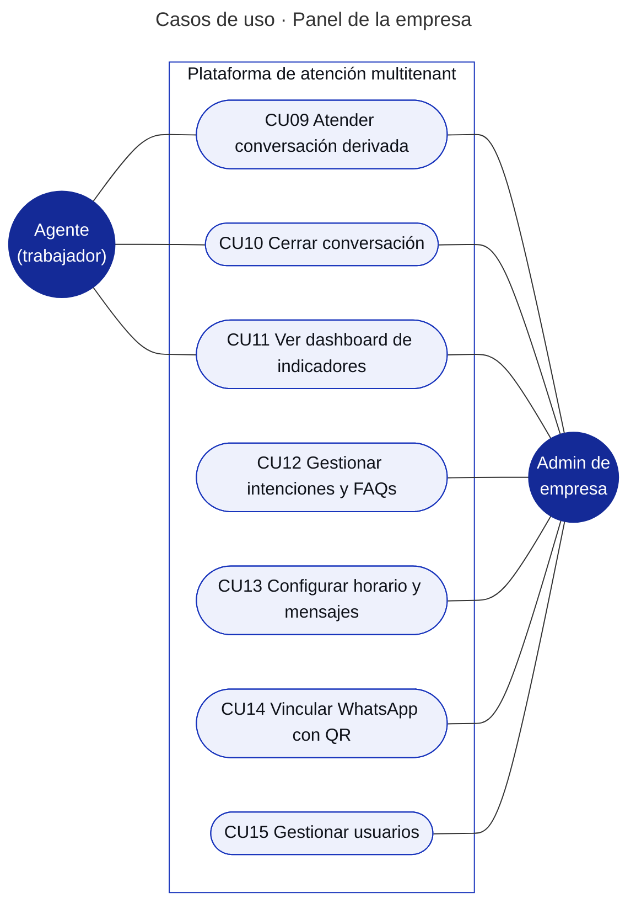

# Casos de uso · Panel de la empresa

Los ejecutan la empresa (Admin de empresa) y sus trabajadores (Agente). Requieren sesión iniciada (CU05). Cada actor solo ve datos de su propia empresa.

```mermaid
---
title: "Casos de uso · Panel de la empresa"
---
flowchart LR
  AG(("Agente<br/>(trabajador)"))

  subgraph SYS["Plataforma de atención multitenant"]
    UC09(["CU09 Atender conversación derivada"])
    UC10(["CU10 Cerrar conversación"])
    UC11(["CU11 Ver dashboard de indicadores"])
    UC12(["CU12 Gestionar intenciones y FAQs"])
    UC13(["CU13 Configurar horario y mensajes"])
    UC14(["CU14 Vincular WhatsApp con QR"])
    UC15(["CU15 Gestionar usuarios"])
  end

  AD(("Admin de<br/>empresa"))

  AG --- UC09
  AG --- UC10
  AG --- UC11
  UC09 --- AD
  UC10 --- AD
  UC11 --- AD
  UC12 --- AD
  UC13 --- AD
  UC14 --- AD
  UC15 --- AD

  classDef actor fill:#142A97,stroke:#142A97,color:#FFFFFF
  classDef usecase fill:#EEF1FC,stroke:#1834BC,color:#0F1219
  class AG,AD actor
  class UC09,UC10,UC11,UC12,UC13,UC14,UC15 usecase
  style SYS fill:#FFFFFF,stroke:#1834BC,color:#0F1219
```
