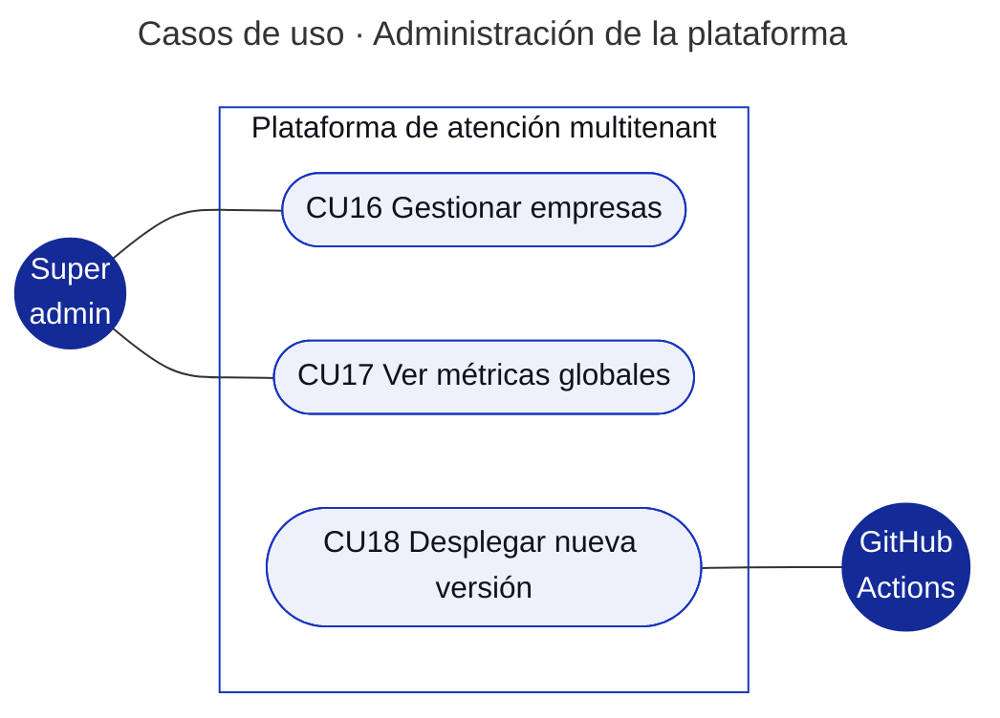

# Casos de uso · Administración de la plataforma

El superadministrador gestiona empresas pero no lee los mensajes de sus clientes.

```mermaid
---
title: "Casos de uso · Administración de la plataforma"
---
flowchart LR
  SA(("Super<br/>admin"))

  subgraph SYS["Plataforma de atención multitenant"]
    UC16(["CU16 Gestionar empresas"])
    UC17(["CU17 Ver métricas globales"])
    UC18(["CU18 Desplegar nueva versión"])
  end

  GH(("GitHub<br/>Actions"))

  SA --- UC16
  SA --- UC17
  UC18 --- GH

  classDef actor fill:#142A97,stroke:#142A97,color:#FFFFFF
  classDef usecase fill:#EEF1FC,stroke:#1834BC,color:#0F1219
  class SA,GH actor
  class UC16,UC17,UC18 usecase
  style SYS fill:#FFFFFF,stroke:#1834BC,color:#0F1219
```
