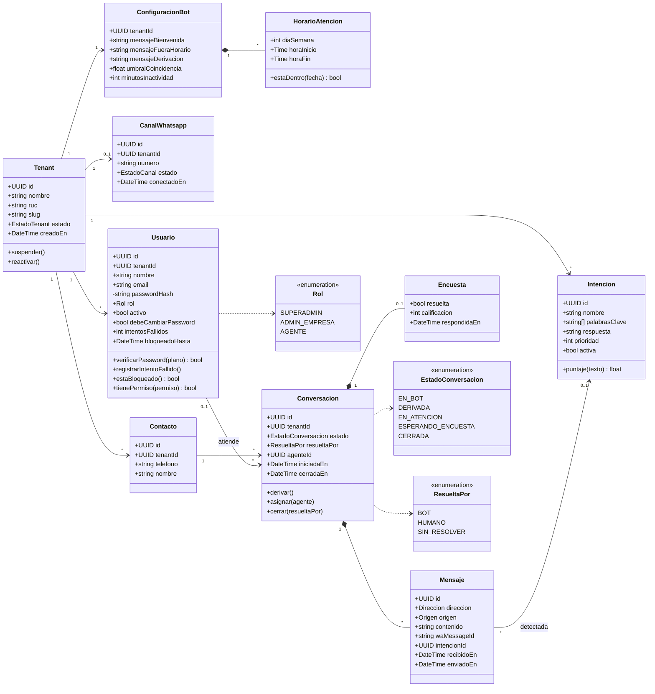

# Diagrama de clases del dominio

Entidades principales del backend y sus relaciones. Todas las entidades de negocio pertenecen a un `Tenant`.

```mermaid
classDiagram
  direction LR

  class Tenant {
    +UUID id
    +string nombre
    +string ruc
    +string slug
    +EstadoTenant estado
    +DateTime creadoEn
    +suspender()
    +reactivar()
  }

  class Usuario {
    +UUID id
    +UUID tenantId
    +string nombre
    +string email
    -string passwordHash
    +Rol rol
    +bool activo
    +bool debeCambiarPassword
    +int intentosFallidos
    +DateTime bloqueadoHasta
    +verificarPassword(plano) bool
    +registrarIntentoFallido()
    +estaBloqueado() bool
    +tienePermiso(permiso) bool
  }

  class CanalWhatsapp {
    +UUID id
    +UUID tenantId
    +string numero
    +EstadoCanal estado
    +DateTime conectadoEn
  }

  class ConfiguracionBot {
    +UUID tenantId
    +string mensajeBienvenida
    +string mensajeFueraHorario
    +string mensajeDerivacion
    +float umbralCoincidencia
    +int minutosInactividad
  }

  class HorarioAtencion {
    +int diaSemana
    +Time horaInicio
    +Time horaFin
    +estaDentro(fecha) bool
  }

  class Intencion {
    +UUID id
    +string nombre
    +string[] palabrasClave
    +string respuesta
    +int prioridad
    +bool activa
    +puntaje(texto) float
  }

  class Contacto {
    +UUID id
    +UUID tenantId
    +string telefono
    +string nombre
  }

  class Conversacion {
    +UUID id
    +UUID tenantId
    +EstadoConversacion estado
    +ResueltaPor resueltaPor
    +UUID agenteId
    +DateTime iniciadaEn
    +DateTime cerradaEn
    +derivar()
    +asignar(agente)
    +cerrar(resueltaPor)
  }

  class Mensaje {
    +UUID id
    +Direccion direccion
    +Origen origen
    +string contenido
    +string waMessageId
    +UUID intencionId
    +DateTime recibidoEn
    +DateTime enviadoEn
  }

  class Encuesta {
    +bool resuelta
    +int calificacion
    +DateTime respondidaEn
  }

  class Rol {
    <<enumeration>>
    SUPERADMIN
    ADMIN_EMPRESA
    AGENTE
  }

  class EstadoConversacion {
    <<enumeration>>
    EN_BOT
    DERIVADA
    EN_ATENCION
    ESPERANDO_ENCUESTA
    CERRADA
  }

  class ResueltaPor {
    <<enumeration>>
    BOT
    HUMANO
    SIN_RESOLVER
  }

  Tenant "1" --> "*" Usuario
  Tenant "1" --> "0..1" CanalWhatsapp
  Tenant "1" --> "1" ConfiguracionBot
  ConfiguracionBot "1" *-- "*" HorarioAtencion
  Tenant "1" --> "*" Intencion
  Tenant "1" --> "*" Contacto
  Contacto "1" --> "*" Conversacion
  Conversacion "1" *-- "*" Mensaje
  Conversacion "1" *-- "0..1" Encuesta
  Usuario "0..1" --> "*" Conversacion : atiende
  Mensaje "*" --> "0..1" Intencion : detectada
  Usuario ..> Rol
  Conversacion ..> EstadoConversacion
  Conversacion ..> ResueltaPor
```
