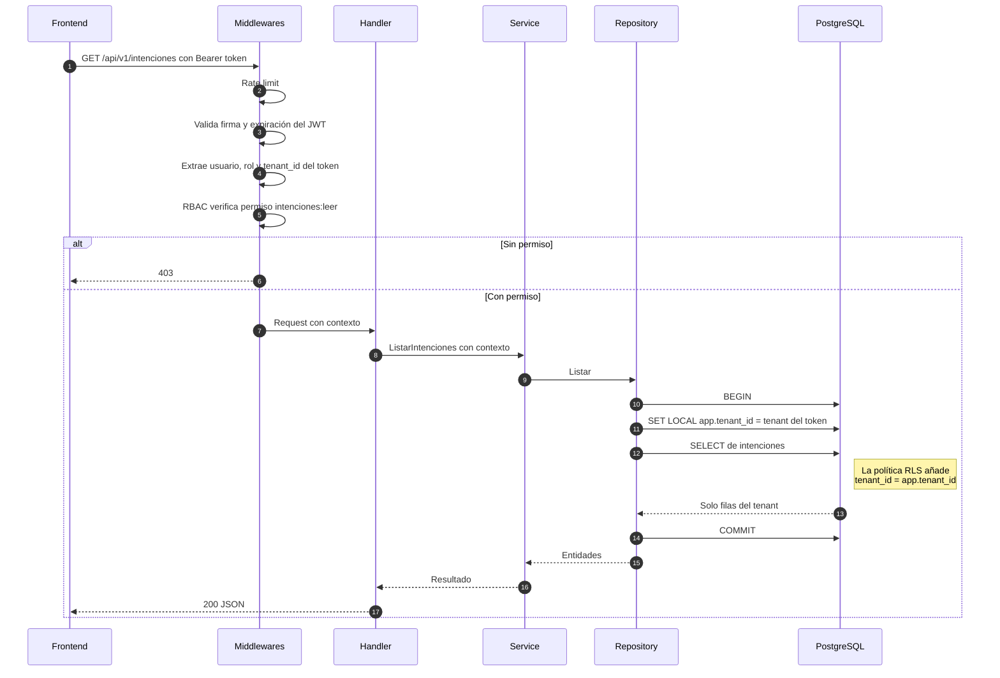

# Secuencia — Petición protegida con aislamiento por tenant

Muestra cómo el tenant sale del token, nunca de la URL ni del body, y cómo PostgreSQL filtra por su cuenta con RLS.

```mermaid
sequenceDiagram
  autonumber
  participant W as Frontend
  participant M as Middlewares
  participant H as Handler
  participant S as Service
  participant R as Repository
  participant D as PostgreSQL

  W->>M: GET /api/v1/intenciones con Bearer token
  M->>M: Rate limit
  M->>M: Valida firma y expiración del JWT
  M->>M: Extrae usuario, rol y tenant_id del token
  M->>M: RBAC verifica permiso intenciones:leer
  alt Sin permiso
    M-->>W: 403
  else Con permiso
    M->>H: Request con contexto
    H->>S: ListarIntenciones con contexto
    S->>R: Listar
    R->>D: BEGIN
    R->>D: SET LOCAL app.tenant_id = tenant del token
    R->>D: SELECT de intenciones
    Note right of D: La política RLS añade<br/>tenant_id = app.tenant_id
    D-->>R: Solo filas del tenant
    R->>D: COMMIT
    R-->>S: Entidades
    S-->>H: Resultado
    H-->>W: 200 JSON
  end
```
