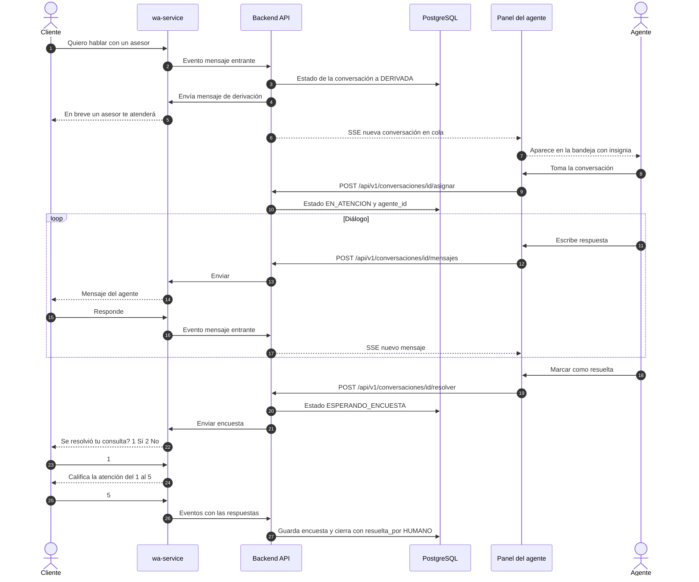

# Secuencia — Derivación a un agente y encuesta

```mermaid
sequenceDiagram
  autonumber
  actor C as Cliente
  participant G as wa-service
  participant A as Backend API
  participant D as PostgreSQL
  participant P as Panel del agente
  actor AG as Agente

  C->>G: Quiero hablar con un asesor
  G->>A: Evento mensaje entrante
  A->>D: Estado de la conversación a DERIVADA
  A->>G: Envía mensaje de derivación
  G-->>C: En breve un asesor te atenderá
  A-->>P: SSE nueva conversación en cola
  P-->>AG: Aparece en la bandeja con insignia
  AG->>P: Toma la conversación
  P->>A: POST /api/v1/conversaciones/id/asignar
  A->>D: Estado EN_ATENCION y agente_id
  loop Diálogo
    AG->>P: Escribe respuesta
    P->>A: POST /api/v1/conversaciones/id/mensajes
    A->>G: Enviar
    G-->>C: Mensaje del agente
    C->>G: Responde
    G->>A: Evento mensaje entrante
    A-->>P: SSE nuevo mensaje
  end
  AG->>P: Marcar como resuelta
  P->>A: POST /api/v1/conversaciones/id/resolver
  A->>D: Estado ESPERANDO_ENCUESTA
  A->>G: Enviar encuesta
  G-->>C: Se resolvió tu consulta? 1 Sí 2 No
  C->>G: 1
  G-->>C: Califica la atención del 1 al 5
  C->>G: 5
  G->>A: Eventos con las respuestas
  A->>D: Guarda encuesta y cierra con resuelta_por HUMANO
```
