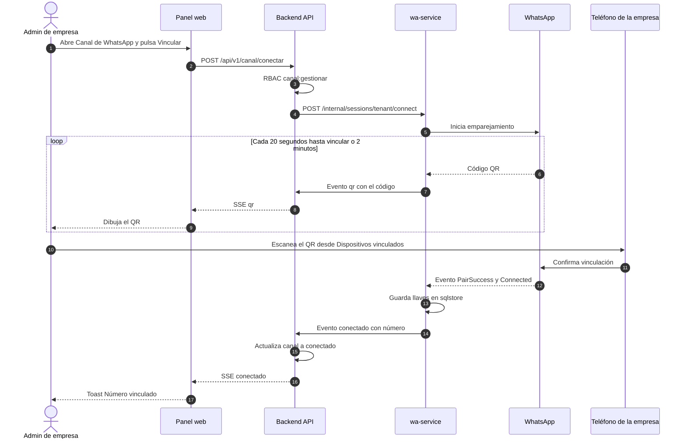

# Secuencia — Vinculación del número de WhatsApp con QR

```mermaid
sequenceDiagram
  autonumber
  actor AD as Admin de empresa
  participant P as Panel web
  participant A as Backend API
  participant G as wa-service
  participant WA as WhatsApp
  participant T as Teléfono de la empresa

  AD->>P: Abre Canal de WhatsApp y pulsa Vincular
  P->>A: POST /api/v1/canal/conectar
  A->>A: RBAC canal:gestionar
  A->>G: POST /internal/sessions/tenant/connect
  G->>WA: Inicia emparejamiento
  loop Cada 20 segundos hasta vincular o 2 minutos
    WA-->>G: Código QR
    G->>A: Evento qr con el código
    A-->>P: SSE qr
    P-->>AD: Dibuja el QR
  end
  AD->>T: Escanea el QR desde Dispositivos vinculados
  T->>WA: Confirma vinculación
  WA-->>G: Evento PairSuccess y Connected
  G->>G: Guarda llaves en sqlstore
  G->>A: Evento conectado con número
  A->>A: Actualiza canal a conectado
  A-->>P: SSE conectado
  P-->>AD: Toast Número vinculado
```
