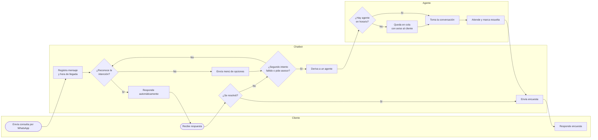

# Proceso de atención propuesto (TO-BE)

Situación con la plataforma (postest, O₂). El bot responde las consultas frecuentes a cualquier hora y deriva solo lo que necesita una persona.

```mermaid
flowchart LR
  subgraph CLIENTE["Cliente"]
    C1(["Envía consulta por WhatsApp"])
    C2(["Recibe respuesta"])
    C3["Responde encuesta"]
  end

  subgraph BOT["Chatbot"]
    B1["Registra mensaje<br/>y hora de llegada"]
    B2{"¿Reconoce la<br/>intención?"}
    B3["Responde automáticamente"]
    B4{"¿Se resolvió?"}
    B5["Envía menú de opciones"]
    B6{"¿Segundo intento<br/>fallido o pide asesor?"}
    B7["Deriva a un agente"]
    B8["Envía encuesta"]
  end

  subgraph AGENTE["Agente"]
    A1{"¿Hay agente<br/>en horario?"}
    A2["Queda en cola<br/>con aviso al cliente"]
    A3["Toma la conversación"]
    A4["Atiende y marca resuelta"]
  end

  C1 --> B1 --> B2
  B2 -- "Sí" --> B3 --> C2
  C2 --> B4
  B4 -- "Sí" --> B8
  B4 -- "No" --> B6
  B2 -- "No" --> B5 --> B6
  B6 -- "No" --> B2
  B6 -- "Sí" --> B7 --> A1
  A1 -- "No" --> A2 --> A3
  A1 -- "Sí" --> A3
  A3 --> A4 --> B8
  B8 --> C3
```
