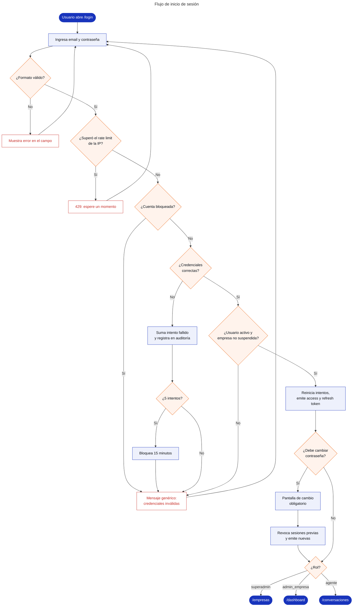

# Flujo de inicio de sesión

Diagrama de actividad del login completo, con bloqueo por intentos, cambio obligatorio de contraseña y redirección según el rol.

```mermaid
---
title: "Flujo de inicio de sesión"
---
flowchart TB
  S(["Usuario abre /login"]) --> F["Ingresa email y contraseña"]
  F --> V{"¿Formato válido?"}
  V -- "No" --> E1["Muestra error en el campo"] --> F
  V -- "Sí" --> RL{"¿Superó el rate limit<br/>de la IP?"}
  RL -- "Sí" --> E2["429: espere un momento"] --> F
  RL -- "No" --> B{"¿Cuenta bloqueada?"}
  B -- "Sí" --> E3["Mensaje genérico:<br/>credenciales inválidas"] --> F
  B -- "No" --> C{"¿Credenciales<br/>correctas?"}
  C -- "No" --> I["Suma intento fallido<br/>y registra en auditoría"]
  I --> L{"¿5 intentos?"}
  L -- "Sí" --> BL["Bloquea 15 minutos"] --> E3
  L -- "No" --> E3
  C -- "Sí" --> A{"¿Usuario activo y<br/>empresa no suspendida?"}
  A -- "No" --> E3
  A -- "Sí" --> T["Reinicia intentos,<br/>emite access y refresh token"]
  T --> P{"¿Debe cambiar<br/>contraseña?"}
  P -- "Sí" --> CP["Pantalla de cambio<br/>obligatorio"] --> T2["Revoca sesiones previas<br/>y emite nuevas"] --> R
  P -- "No" --> R{"¿Rol?"}
  R -- "superadmin" --> R1(["/empresas"])
  R -- "admin_empresa" --> R2(["/dashboard"])
  R -- "agente" --> R3(["/conversaciones"])

  classDef step fill:#EEF1FC,stroke:#1834BC,color:#0F1219
  classDef decision fill:#FFF3EC,stroke:#EB6B1D,color:#0F1219
  classDef terminal fill:#1834BC,stroke:#1834BC,color:#FFFFFF
  classDef error fill:#FFFFFF,stroke:#C8312B,color:#C8312B
  class F,I,BL,T,CP,T2 step
  class V,RL,B,C,L,A,P,R decision
  class S,R1,R2,R3 terminal
  class E1,E2,E3 error
```
