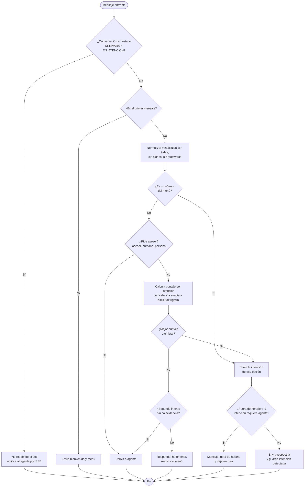

# Algoritmo del motor del bot

Bot basado en reglas: normaliza el texto, compara contra las palabras clave de cada intención del tenant y responde si el puntaje supera el umbral configurado.

```mermaid
flowchart TB
  S(["Mensaje entrante"]) --> E{"¿Conversación en estado<br/>DERIVADA o EN_ATENCION?"}
  E -- "Sí" --> H["No responde el bot<br/>notifica al agente por SSE"] --> F(["Fin"])
  E -- "No" --> W{"¿Es el primer mensaje?"}
  W -- "Sí" --> WB["Envía bienvenida y menú"] --> F
  W -- "No" --> N["Normaliza: minúsculas, sin tildes,<br/>sin signos, sin stopwords"]
  N --> K{"¿Es un número<br/>del menú?"}
  K -- "Sí" --> I["Toma la intención<br/>de esa opción"]
  K -- "No" --> X{"¿Pide asesor?<br/>asesor, humano, persona"}
  X -- "Sí" --> D["Deriva a agente"] --> F
  X -- "No" --> P["Calcula puntaje por intención<br/>coincidencia exacta + similitud trigram"]
  P --> U{"¿Mejor puntaje<br/>≥ umbral?"}
  U -- "Sí" --> I
  U -- "No" --> R{"¿Segundo intento<br/>sin coincidencia?"}
  R -- "Sí" --> D
  R -- "No" --> M["Responde: no entendí,<br/>reenvía el menú"] --> F
  I --> O{"¿Fuera de horario y la<br/>intención requiere agente?"}
  O -- "Sí" --> FH["Mensaje fuera de horario<br/>y deja en cola"] --> F
  O -- "No" --> RS["Envía respuesta<br/>y guarda intención detectada"] --> F
```
